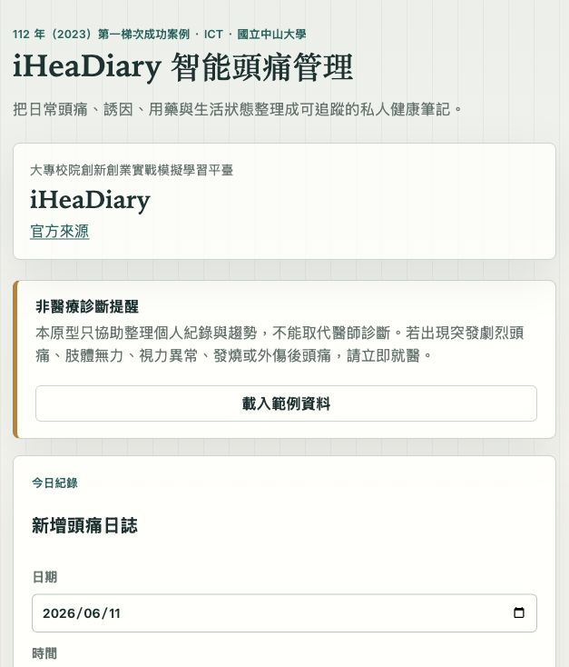
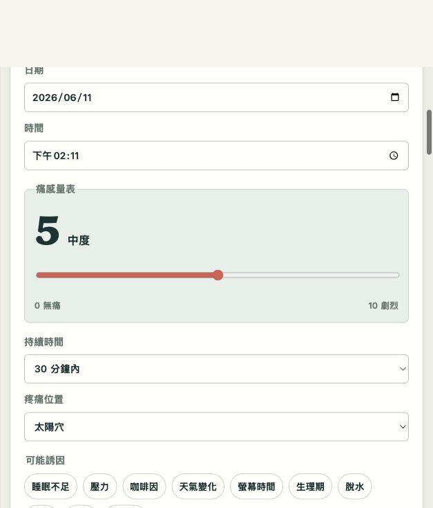

# iHeaDiary 智能頭痛管理 Demo

## 快速看懂

- 線上 Demo：https://atlasforcn.github.io/startup-iheadiary-headache/
- 這個原型在做什麼：把 iHeaDiary 做成頭痛日誌與誘因分析工具。
- 特色定位：特色是把痛感量表、誘因、睡眠/壓力與就醫摘要整理成可帶去門診的資料。
- 操作流程：新增頭痛紀錄與痛感量表 → 標記誘因、用藥、睡眠與壓力 → 查看趨勢圖、誘因排行與就醫摘要

展開完整功能流程截圖

這是一個可直接用瀏覽器開啟的靜態概念原型，將「iHeaDiary 智能頭痛管理」延伸成頭痛日誌與誘因分析 App/儀表板。使用純 HTML、CSS、JavaScript 製作，無外部依賴，適合部署到 GitHub Pages。

## 比賽與來源資訊

- 比賽來源：大專校院創新創業實戰模擬學習平臺
- 年度：112 年（2023）
- 屆次/階段：第一梯次成功案例
- 團隊/公司：iHeaDiary
- 學校：國立中山大學
- 類別：ICT
- 作品名稱：iHeaDiary 智能頭痛管理
- 官方來源：https://ssp.moe.gov.tw/cases/544

## 原型功能

- 頭痛日誌：記錄日期、時間、痛感量表、持續時間、疼痛位置與備註。
- 誘因標籤：快速勾選睡眠不足、壓力、咖啡因、天氣變化、螢幕時間等常見誘因。
- 生活追蹤：同步記錄用藥、睡眠、壓力與飲水。
- 趨勢分析：以本機資料產生痛感趨勢、誘因排行、平均痛感、發作天數與高痛感比例。
- 就醫摘要：自動整理近期紀錄，方便使用者複製給醫師參考。
- 提醒：可設定日誌提醒與補水提醒，資料保存在瀏覽器本機。

## 使用方式

直接開啟 `index.html` 即可使用。所有互動資料都儲存在目前瀏覽器的 localStorage，不會傳送到任何伺服器。

## 免責聲明

這是依公開得獎資訊與概念自行製作的興趣原型，不是原團隊官方 demo 或產品。本原型僅用於展示互動概念與資料整理方式，不能取代專業醫療診斷、治療或醫師建議。若有劇烈頭痛、突發神經症狀、視力異常、發燒、外傷後頭痛或症狀快速惡化，請立即就醫。
